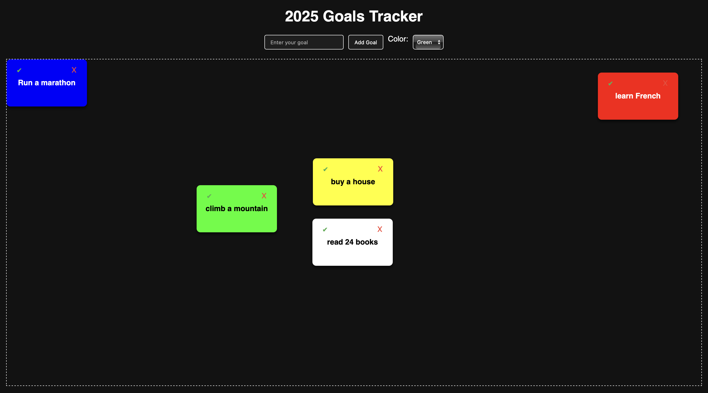

# 2025 Goals Tracker

A simple and interactive web application to set, track, and manage your goals for 2025. Celebrate your progress with smooth animations and fireworks, and enjoy the ability to customize your goal tiles with colors.

## Features

- **Add, Complete, and Remove Goals**: Manage your goals with ease.
- **Drag-and-Drop**: Rearrange goal tiles within the container.
- **Fireworks Celebration**: Celebrate every new goal with fireworks.
- **Persistent Storage**: Goals and their positions are saved locally in your browser.
- **Custom Colors**: Choose a color for each goal tile for easy visualization.
- **Dynamic Text Contrast**: Tile text automatically adjusts for readability.

## Installation

1. Clone the repository:
   ```bash
   git clone https://github.com/j-abed/2025-goals.git
   ```
2. Navigate to the project directory:
   ```bash
   cd 2025-goals
   ```
3. Open `index.html` in your browser to start using the app.

## Usage

1. Enter a goal in the input field.
2. Choose a color for your goal tile.
3. Click the "Add Goal" button to add the goal.
4. Drag the tiles to rearrange them within the container.
5. Mark a goal as completed by clicking the ✔ button or remove it using the ✖ button.

## Deployment

This project is designed for deployment using **GitHub Pages**. Follow these steps to deploy:

1. Ensure all code is pushed to the `main` branch on GitHub.
2. Go to your repository’s **Settings**.
3. Scroll down to the **Pages** section on the left-hand menu.
4. Under **Source**, select the `main` branch and click **Save**.
5. GitHub will generate a URL for your site:
   ```
   https://<your-username>.github.io/2025-goals/
   ```
6. Visit the URL to access your deployed app.

## License

This project is licensed under the [MIT License](LICENSE).

## Screenshots

### Main Interface


### Drag-and-Drop Example


---

Happy goal-setting! 🎯
